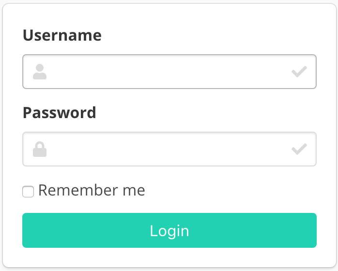

## Requirements

-   Python 3.6+
-   Django 2.1.7+
-   Node.js 8.0+
-   Google Chrome (highly recommended)

## Installation

### Clone repository

First of all, you have to clone the repository:

```bash
git clone https://github.com/chakki-works/doccano.git
cd doccano
```

### Install application

To install doccano, there are three options:

#### Setup Python environment

First we need to install the dependencies. Run the following commands:

```bash
sudo apt-get install libpq-dev
pip install -r requirements.txt
cd app
```

Next we need to start the webpack server so that the frontend gets compiled continuously.
Run the following commands in a new shell:

```bash
cd server/static
npm install
npm run build
# npm start  # for developers
cd ..
```

## Usage

### Start the development server

Let’s start the development server and explore it.

Depending on your installation method, there are three options:

#### Running Django development server

Before running, we need to make migration. Run the following command:

```bash
python manage.py migrate
```

Next we need to create a user who can login to the admin site. Run the following command:

```bash
python manage.py create_admin --noinput --username "admin" --email "admin@example.com" --password "password"
```

Create the admin, annotator, and annotation approver roles to assign to users. Run the following command:

```bash
python manage.py create_roles
```

Developers can also validate that the project works as expected by running the tests:

```bash
python manage.py test server.tests
```

Finally, to start the server, run the following command:

```bash
python manage.py runserver
```

Optionally, you can change the bind ip and port using the command

```bash
python manage.py runserver <ip>:<port>
```

### Confirm all application services are running
Open a Web browser and go to <http://127.0.0.1:8000/login/>. You should see the login screen:



## Contribution

This code was heavily inspired by [Doccano](https://github.com/chakki-works/doccano/wiki/How-to-Contribute-to-Doccano-Project)
